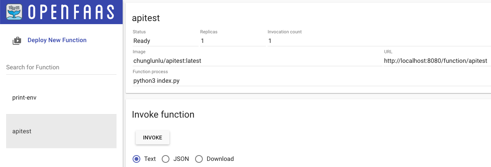

# OpenFaaS

## Command
`faas-cli up` including following actions
* `faas-cli build`: create a local container image, and install any other files needed, like those in the `requirements.txt` file
* `faas-cli push`: transfer the function's container image from local Docker library up to the hosted registry
* `faas-cli deploy`: using the OpenFaaS REST API, create a Deployment inside the Kubernetes cluster and a new Pod to serve traffic
* `faas-cli secret create`: create a secret from a literal value or from a file

All OpenFaaS secrets are mounted at /var/openfaas/secrets/NAME.

## Build
```
cd /Users/chunglun/Documents/GitHub/OpenFaaS
```

Pull template
```
/Users/chunglun/.arkade/bin/faas-cli template store pull python3-http
```

Create
```
export OPENFAAS_PREFIX=yourRegistryPrefix 
/Users/chunglun/.arkade/bin/faas-cli new --lang python3 apitest
```

Build
```
/Users/chunglun/.arkade/bin/faas-cli up -f apitest.yml
```

## Test
```
curl http://127.0.0.1:8080/function/apitest

curl --data "bytes" http://127.0.0.1:8080/function/apitest
```


```
curl http://127.0.0.1:8080/function/apitest --data-binary '{ "name": "CLLUV", "greeting": "Hallo"}'
```

```
curl -sLS https://upload.wikimedia.org/wikipedia/commons/8/85/The_Golden_Gate_Bridge_and_Comet_C2020_F3_NEOWISE_and.jpg -o /Users/chunglun/Documents/GitHub/OpenFaaS/golden-gate.jpg
```

## Troubleshooting
Get funciton deployments
```
kubectl get deployments -n openfaas-fn
```

Show logs
```
/Users/chunglun/.arkade/bin/faas-cli logs homepage

kubectl logs -n openfaas-fn deploy/homepage
```

Check the events in the openfaas-fn namespace to see if there is a crash, a node out of resources, or trouble pulling your image.
```
kubectl get events --sort-by=.metadata.creationTimestamp -n openfaas-fn
```

Check the logs of the OpenFaaS Core Services, such as the gateway
```
kubectl logs -n openfaas deploy/gateway -c gateway
kubectl logs -n openfaas deploy/gateway -c faas-netes
```

Forget the password
```
arkade info openfaas
```

## Invoke Function Asynchronously
OpenFaaS can run any function invocation in the background, and whilst the executions take just as long to complete, they can be run in parallel to save time, and to hide the latency from the caller.

We just need to change the URL from `/function/name/` to `/async-function/name`.

```
time curl -s --data-binary @/tmp/golden-gate.jpg --header "api-key=$(cat ./bw-api-key.txt)" http://127.0.0.1:8080/function/bw-api-protected > /dev/null

time curl -s --data-binary @/tmp/golden-gate.jpg --header "api-key=$(cat ./bw-api-key.txt)" http://127.0.0.1:8080/async-function/bw-api-protected
``````


